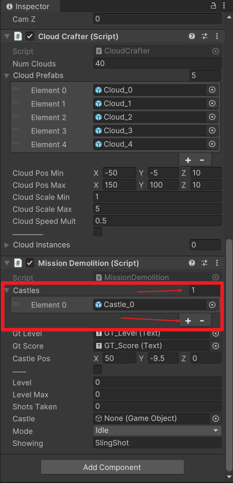

## Mission Demolition Prototype

> 本游戏实例出自《游戏设计、原型与开发 基于Unity与C#从构思到实现》。书中使用Unity4完成，本仓库使用Unity2022版本完成该教程。  

游戏简介：类似《愤怒的小鸟》，玩家拖动弹弓，打倒建筑物，攻击到目标。  

## 实现的功能

- 摄像机的跟随
- 摄像机的三种聚焦模式：全局、弹弓和城堡
- 云的移动（还有大小的变化）
- 游戏流程的控制（MissionDemolition脚本），一个城堡算一关
- 当鼠标点击弹弓时进入瞄准模式，会有光圈
- 弹丸发射后开始绘制轨迹线条

## 需要注意的地方

代码中经常出现 `public bool _____;`。这是作为分隔符使用，在检视面板中分隔**应在检视面板设置的成员**和**应该通过代码动态调整的成员**。

---

书中使用到`GUIText`控件，但是Unity2022已经舍弃了该控件，因此我使用了`UGUI`控件来显示得分。

---

所有关卡都在同一个场景中进行。添加关卡时，其实添加的是城堡的预制体，然后在`MissionDemolition`的检视面板上添加城堡。一个城堡就是一个关卡。

---

待补充......